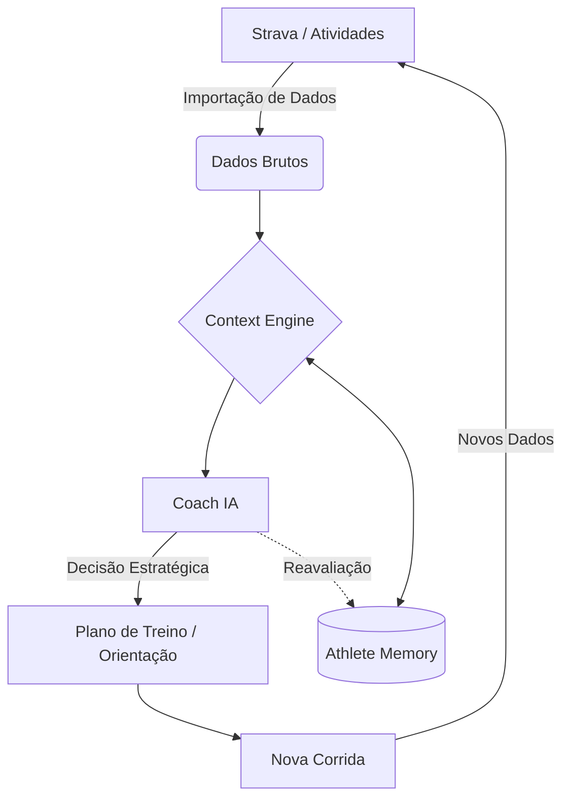

# Pacemaker
### Training Intelligence for Runners

Todo corredor conhece essa sensação.

Você termina um treino, abre o Strava e vê os números: distância, pace, frequência cardíaca, altimetria. Você fecha o aplicativo, mas uma pergunta permanece no ar:

**"O que eu faço amanhã?"**

Foi exatamente para responder a essa pergunta que o Pacemaker nasceu. 

Enquanto ferramentas tradicionais focam em registrar o que já passou, o Pacemaker decide o próximo passo. Ele é o cérebro estratégico que interpreta seus dados, extrai contexto e transforma métricas brutas em decisões inteligentes para o seu próximo quilômetro.

---

## 💎 O que torna o Pacemaker diferente?

Diferente de aplicativos de corrida convencionais ou chatbots genéricos, o Pacemaker não toma decisões isoladas.

*   **Inteligência Contextual:** Nenhuma recomendação é baseada apenas no treino de hoje. Toda orientação considera semanas de histórico, tendências de fadiga e a evolução real do atleta.
*   **Athlete Memory:** Uma base de conhecimento estruturada que garante que o sistema nunca esqueça quem você é, quais são suas lesões passadas e quais são seus objetivos de vida.
*   **Coach IA Especializado:** Uma inteligência treinada para agir como um mentor estratégico, desafiando e guiando o atleta com base no contexto completo, não apenas respondendo perguntas.

---

## 🧠 Como o Pacemaker pensa

O Pacemaker funciona como um ciclo contínuo de inteligência. Em poucos segundos, qualquer pessoa consegue entender como a mágica acontece:

**Strava** → **Dados** → **Context Engine** → **Athlete Memory** → **Coach IA** → **Plano** → **Nova Corrida** → **Nova Estratégia**

---

## 📁 Athlete Memory (Single Source of Truth)

A **Athlete Memory** é o coração da personalização no Pacemaker. Ela atua como a **Single Source of Truth** (Fonte Única de Verdade), garantindo que cada decisão do Coach IA seja consistente.

O sistema mantém uma visão holística e permanente sobre:
*   **Histórico e Evolução:** O que você já conquistou e como seu corpo reage ao volume.
*   **Objetivos e Metas:** Para qual prova você está treinando e qual seu tempo alvo.
*   **Rotina de Vida:** Seus horários, dias de musculação e limitações reais.
*   **Saúde:** Histórico de lesões e observações físicas constantes.

O atleta nunca precisa se explicar duas vezes. O Pacemaker já conhece o caminho.

---

## 🚀 Funcionalidades Atuais

**Current Version:** v0.9.x (Release Candidate / Launch Polish)

### Ecossistema de Produto
*   **Coach IA & Context Engine:** Orientação estratégica baseada em análise profunda de tendências.
*   **Planner & Dashboard:** Gestão visual e intuitiva do seu calendário e progresso.
*   **Race IQ:** Inteligência dedicada para planejar e otimizar sua performance em provas.
*   **Weekly Reports:** Resumos automáticos de progresso, destacando acertos e riscos.
*   **Athlete Memory:** Memória estruturada que sustenta toda a personalização do app.
*   **Smart Onboarding:** Mapeamento inicial completo do perfil e objetivos do atleta.

### Infraestrutura e Experiência
*   **Google Login & Multi-device:** Acesso seguro e sincronizado em qualquer dispositivo.
*   **Firebase Sync & Firestore:** Sincronização em tempo real com **Persistência Offline**.
*   **Remote AI Configuration:** Ajustes de inteligência via nuvem para evolução contínua sem interrupções.
*   **Desktop Experience:** Interface otimizada para análise e planejamento em telas grandes.

---

## ⚙️ Arquitetura e Evolução

O Pacemaker combina tecnologias modernas com uma visão de produto modular e escalável:

*   **Frontend:** Single Page Application (SPA) ágil e responsiva.
*   **Backend/Data:** Ecossistema Firebase (Auth, Firestore, Remote Config).
*   **AI Engine:** Google Gemini API com motor de contexto proprietário.
*   **Evolução:** Arquitetura preparada para crescimento contínuo da plataforma e expansão de funcionalidades.

---

## 🗺️ Roadmap de Evolução

### v0.9.x — Launch Polish (Atual)
*   Refinamento visual e revisão de UX para uma experiência memorável.
*   Consolidação da Athlete Memory como o motor central de todas as decisões.

### v1.0 — Public Release
*   Lançamento oficial da plataforma completa para a comunidade de corredores.

### v1.1 — Coach Evolution
*   **Coach Socrático:** IA investigativa que aprofunda o contexto antes de sugerir mudanças.
*   **Discordância Inteligente:** Capacidade de negar treinos prejudiciais com base em dados de segurança.

### v2.0 — Automatic Planning
*   **Plano Adaptativo:** Replanejamento dinâmico automático.
*   **Treino Automático:** Sugestões proativas diárias baseadas no seu estado de recuperação.

---

**Cada treino conta uma história. O Pacemaker garante que ela influencie o próximo capítulo.**

© 2026 Pacemaker. Transformando dados de corrida em decisões inteligentes.
