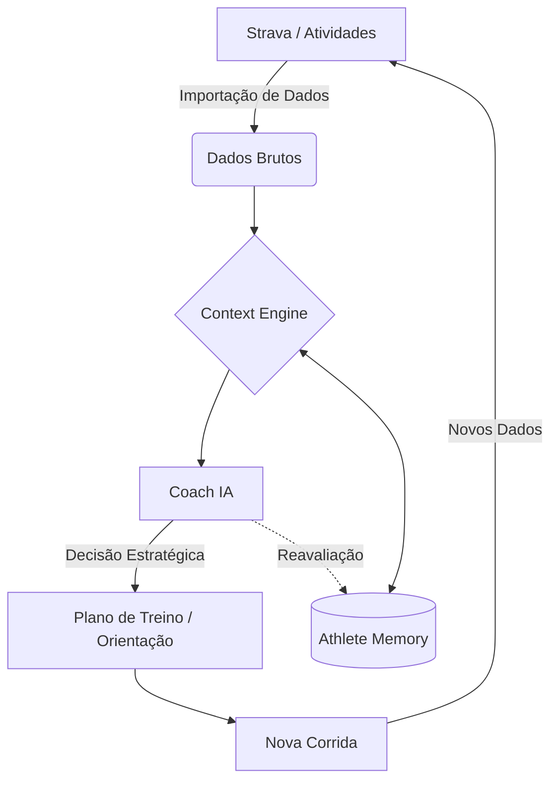

# Pacemaker — Decidindo o próximo passo.

**O Strava registra o passado. O Pacemaker decide o futuro.**

O Pacemaker não é apenas mais um rastreador de atividades; é o cérebro estratégico do seu treinamento. Enquanto ferramentas tradicionais focam em documentar o que já aconteceu, o Pacemaker interpreta esses dados, extrai contexto e transforma métricas brutas em decisões inteligentes para o seu próximo treino.

Nossa missão é democratizar o coaching de alta performance, oferecendo uma plataforma que não apenas acompanha sua corrida, mas entende sua evolução e orienta sua jornada de forma adaptativa e personalizada.

---

## 💎 O que torna o Pacemaker diferente?

Diferente de aplicativos de corrida convencionais ou chatbots genéricos, o Pacemaker combina tecnologia proprietária para criar uma experiência de orientação real:

*   **Context Engine:** Um motor de análise que identifica tendências de volume, fadiga e performance a longo prazo.
*   **Athlete Memory:** Uma base de conhecimento estruturada que garante que o sistema nunca esqueça quem você é.
*   **Coach IA Especializado:** Uma inteligência treinada para agir como um mentor, não apenas respondendo perguntas, mas desafiando e guiando o atleta.
*   **Análise Holística:** O foco não é o registro isolado de uma atividade, mas como cada treino se encaixa na sua evolução histórica e nos seus objetivos futuros.

---

## 🏃‍♂️ Filosofia: Do Dado à Evolução

O propósito do Pacemaker começa onde o registro termina. Nossa filosofia fundamental guia cada linha de código e cada decisão de produto:

> **Dados → Contexto → Decisão → Evolução**

Acreditamos que o futuro do treinamento não está em simplesmente correr mais, mas em tomar decisões melhores baseadas em dados reais e contexto individual.

---

## 📁 Athlete Memory (Single Source of Truth)

A **Athlete Memory** é o coração da personalização no Pacemaker e atua como a **Single Source of Truth** (Fonte Única de Verdade) do aplicativo. 

Toda decisão tomada pelo Coach IA — desde a sugestão de um ritmo até o ajuste de um plano de prova — parte destas informações estruturadas. Isso garante uma consistência absoluta entre:
*   **Conversas:** O Coach lembra de dores, preferências e feedbacks anteriores.
*   **Treinos:** As recomendações respeitam sua rotina de trabalho e dias de musculação.
*   **Planejamento:** O calendário é ajustado aos seus objetivos reais e tempos alvo.
*   **Evolução:** O sistema acompanha seu progresso físico e histórico de lesões para garantir segurança.

O atleta nunca precisa se explicar duas vezes. O Pacemaker já conhece o caminho.

---

## 🧠 Como o Pacemaker pensa

O fluxo de inteligência do Pacemaker é um ciclo contínuo de feedback e adaptação:

Este ciclo garante que cada quilômetro percorrido alimente a inteligência do sistema, resultando em estratégias cada vez mais precisas e personalizadas.

---

## 🚀 Funcionalidades Atuais

**Current Version:** v0.9.x (Release Candidate / Launch Polish)

### Inteligência e Gestão
*   **Coach IA & Context Engine:** Orientação 24/7 baseada em análise de tendências.
*   **Planner & Dashboard:** Gestão visual completa do seu calendário e progresso.
*   **Race IQ:** Inteligência específica para definição de estratégias de prova.
*   **Weekly Reports:** Relatórios automáticos com resumos de acertos, riscos e próximos passos.
*   **Smart Onboarding:** Mapeamento inicial completo do perfil do atleta.

### Infraestrutura
*   **Google Login & Multi-device:** Acesso sincronizado e seguro em qualquer lugar.
*   **Firebase Sync & Firestore:** Banco de dados em tempo real com **Persistência Offline**.
*   **Remote AI Configuration:** Ajustes de modelo e parâmetros via nuvem, sem necessidade de deploy.
*   **Desktop Experience:** Interface otimizada para análise profunda em telas grandes.

---

## ⚙️ Arquitetura Tecnológica

O Pacemaker foi projetado para ser resiliente e preparado para o futuro:
*   **Frontend:** Single Page Application (SPA) moderna e ágil.
*   **Backend/Data:** Ecossistema Firebase (Auth, Firestore, Remote Config).
*   **AI Engine:** Google Gemini API com motor de contexto proprietário.
*   **Arquitetura:** Preparada para transição para Cloud Functions e escala global.

---

## 🗺️ Roadmap de Evolução

### v0.9.x — Launch Polish (Atual)
*   Refinamento visual e revisão completa de UX.
*   Consolidação da Athlete Memory como motor principal do Coach.
*   Melhorias de usabilidade e estados vazios (Empty States).

### v1.0 — Public Release
*   Lançamento oficial da plataforma completa para o público.

### v1.1 — Coach Evolution
*   **Coach Socrático:** IA investigativa que questiona antes de sugerir.
*   **Discordância Inteligente:** Capacidade de negar solicitações prejudiciais com base em dados.

### v2.0 — Automatic Planning
*   **Plano Adaptativo:** Replanejamento dinâmico em tempo real.
*   **Treino Automático:** Sugestões proativas baseadas em recuperação e metas.

### 🔮 Visão de Longo Prazo
*   **Coach Proativo:** Antecipação de necessidades e alertas de risco de lesão.
*   **Race Simulator:** Simulações avançadas de performance baseadas em percursos reais.
*   **Strava OAuth Nativo:** Integração ainda mais profunda e fluida.
*   **Mobile App Nativo:** Experiência dedicada para iOS e Android.
*   **Notificações Inteligentes:** Lembretes contextuais baseados na sua rotina de vida.

---

**O futuro do treinamento não está em correr mais. Está em tomar decisões melhores.**

© 2026 Pacemaker. Transformando dados de corrida em decisões inteligentes.
