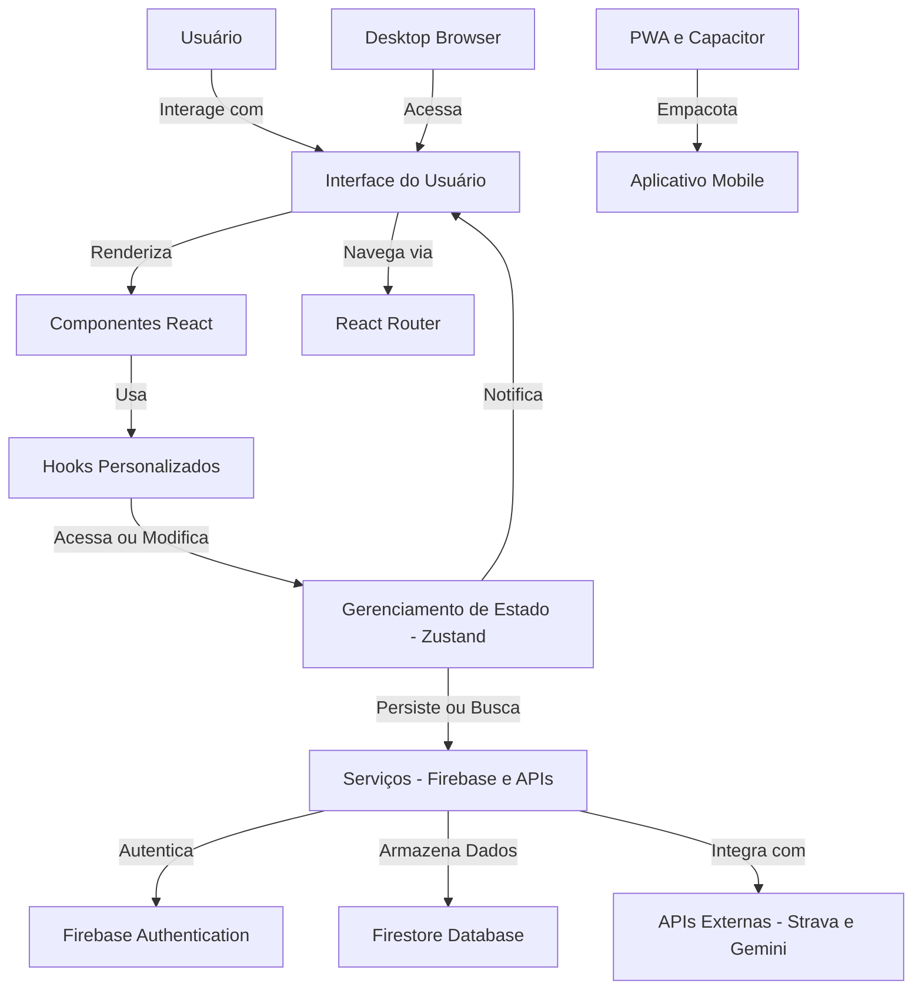

# 🚀 Plano Diretor de Migração: Pacemaker v0.8.5 para React

**De:** Arquiteto de Software Senior (Agente AI)  
**Para:** Fundador/CEO  
**Data:** 15 de Junho de 2026  
**Assunto:** Estratégia Completa para a Transição para React com Foco em Escalabilidade e Manutenibilidade

---

## Introdução
Este documento detalha um plano abrangente para a migração do Pacemaker, atualmente em sua versão v0.8.5 (HTML/CSS/JS puro), para uma arquitetura moderna baseada em React, TypeScript e um ecossistema robusto. O objetivo é construir uma base técnica sólida que suporte os objetivos de longo prazo do produto, incluindo publicação na Play Store, escalabilidade para milhões de usuários e alta manutenibilidade.

---

## 1. Arquitetura Recomendada

A arquitetura proposta para o Pacemaker em React seguirá o padrão de **Componentes Atômicos** com uma forte ênfase em **Separação de Preocupações (SoC)** e **Injeção de Dependências**. Utilizaremos **TypeScript** para garantir robustez e facilitar a manutenção, e **Zustand** para gerenciamento de estado global, devido à sua simplicidade e performance.

### Visão Geral



### Camadas da Aplicação

*   **Camada de Apresentação (UI):** Componentes React (Atoms, Molecules, Organisms, Templates, Pages) responsáveis pela renderização visual e interação com o usuário.
*   **Camada de Lógica de Negócio (Hooks & Utils):** Hooks personalizados e funções utilitárias que encapsulam a lógica específica do domínio (ex: cálculo de pace, lógica do Coach).
*   **Camada de Gerenciamento de Estado (Zustand):** Stores globais para gerenciar o estado da aplicação (usuário, treinos, configurações, chat history).
*   **Camada de Serviços (Services):** Módulos responsáveis pela comunicação com o Firebase (Auth, Firestore) e APIs externas (Strava, Gemini).
*   **Camada de Infraestrutura (Config & Setup):** Configurações de ambiente, PWA, Service Workers, etc.

---

## 2. Estrutura de Pastas

Uma estrutura de pastas bem definida é crucial para a manutenibilidade e escalabilidade. Adotaremos uma abordagem baseada em **domínios/features** e **tipos de componentes**.

```
src/
├── assets/                 # Imagens, ícones, fontes
├── components/             # Componentes React reutilizáveis
│   ├── ui/                 # Componentes genéricos (botões, inputs, modais)
│   ├── layout/             # Componentes de layout (Sidebar, Header, Footer)
│   └── specific/           # Componentes específicos de domínio (CardTreino, ChatMessage)
├── contexts/               # Contextos React (para dados que não precisam de Zustand)
├── hooks/                  # Hooks personalizados (useAuth, usePlanner, useCoach)
├── lib/                    # Funções utilitárias e helpers (date-utils, math-utils)
├── pages/                  # Páginas da aplicação (Dashboard, Coach, Planner, Settings)
├── services/               # Módulos de integração com APIs e Firebase
│   ├── firebase/           # Funções de Auth, Firestore, Storage
│   ├── strava/             # Integração com API do Strava
│   └── gemini/             # Integração com API do Gemini
├── stores/                 # Stores Zustand para gerenciamento de estado global
│   ├── authStore.ts
│   ├── userStore.ts
│   ├── plannerStore.ts
│   └── coachStore.ts
├── styles/                 # Estilos globais e variáveis CSS (Tailwind CSS)
├── types/                  # Definições de tipos TypeScript
├── App.tsx                 # Componente raiz da aplicação
├── main.tsx                # Ponto de entrada da aplicação (renderização)
├── vite-env.d.ts           # Definições de tipos do Vite
└── index.css               # Estilos CSS globais
```

---

## 3. Componentes Reutilizáveis

O Design System definido anteriormente será a base para a criação de componentes reutilizáveis. Eles serão categorizados e construídos com foco em modularidade e testabilidade.

*   **UI Primitivos (`components/ui/`):**
    *   `Button.tsx`, `Input.tsx`, `Modal.tsx`, `Card.tsx`, `Badge.tsx`, `ProgressBar.tsx`, `Chart.tsx`.
    *   Estilizados com Tailwind CSS e variantes para diferentes estados/tipos.
*   **Layout (`components/layout/`):**
    *   `Sidebar.tsx`, `Header.tsx`, `BottomNav.tsx`, `DesktopLayout.tsx`.
    *   Responsáveis pela estrutura visual da aplicação.
*   **Específicos de Domínio (`components/specific/`):**
    *   `TrainingCard.tsx`, `ChatMessage.tsx`, `WeeklyReportCard.tsx`, `PlannerCalendar.tsx`.
    *   Encapsulam a lógica de apresentação de dados específicos do Pacemaker.

---

## 4. Hooks Necessários

Hooks personalizados serão a espinha dorsal da lógica de negócio e da interação com o estado e serviços.

*   `useAuth()`: Gerencia o estado de autenticação do usuário (login, logout, user data).
*   `useUser()`: Acessa e atualiza dados do perfil do usuário no Firestore.
*   `usePlanner()`: Gerencia o estado do planejamento semanal, criação e edição de treinos.
*   `useCoach()`: Interage com o Coach IA (envio de prompts, recebimento de respostas, histórico de chat).
*   `useSync()`: Orquestra a sincronização de dados entre o estado local e o Firestore.
*   `useOffline()`: Detecta o status da conexão e ajusta o comportamento da UI/sincronização.
*   `useDesktopLayout()`: Gerencia o estado do layout desktop (sidebar aberta/fechada, painel direito).

---

## 5. Contexts Globais

Para dados que são consumidos por muitos componentes, mas não precisam de reatividade complexa ou são mais estáticos, utilizaremos o React Context API.

*   `ThemeContext`: Para gerenciar o tema (dark/light mode).
*   `ConfigContext`: Para configurações globais da aplicação que raramente mudam.
*   `ToastContext`: Para exibir mensagens de notificação (toasts) globalmente.

---

## 6. Serviços Firebase

Os serviços Firebase serão encapsulados em módulos dedicados para facilitar a manutenção e a substituição futura, se necessário.

*   **`services/firebase/auth.ts`:**
    *   `signInWithGoogle()`, `signOutUser()`, `onAuthStateChangedListener()`.
*   **`services/firebase/firestore.ts`:**
    *   `getUserData(uid)`, `setUserData(uid, data)`, `getCollection(path)`, `setDoc(path, data)`.
    *   Funções para interagir com coleções específicas (e.g., `getTrainings(uid)`, `getChatHistory(uid)`).
*   **`services/firebase/storage.ts`:** (Futuro) Para upload de imagens de perfil ou anexos.

---

## 7. Estratégia de Roteamento

Utilizaremos o **React Router DOM** para gerenciar as rotas da aplicação, com rotas protegidas para usuários autenticados.

*   **Rotas Principais:** `/dashboard`, `/coach`, `/planner`, `/reports`, `/settings`.
*   **Rotas Aninhadas:** `/planner/:weekId`, `/reports/:reportId`.
*   **Rotas Protegidas:** Todas as rotas principais exigirão autenticação. Usuários não autenticados serão redirecionados para `/login`.
*   **Layouts:** Diferentes layouts para rotas autenticadas (com Sidebar) e não autenticadas (login/onboarding).

---

## 8. Estratégia de Sincronização Offline

Aproveitaremos as capacidades do Firebase Firestore e Service Workers para uma experiência offline robusta.

*   **Firestore Offline Persistence:** O Firestore já oferece persistência offline nativa, armazenando dados em cache localmente. Isso será ativado.
*   **Service Worker (Workbox):** Utilizaremos o Workbox para gerenciar o cache de assets estáticos (HTML, CSS, JS, imagens) e garantir que o PWA seja instalável e funcione offline.
*   **Estratégia de Sincronização:**
    *   **Online:** Dados são sincronizados em tempo real com o Firestore.
    *   **Offline:** Operações de escrita são enfileiradas e executadas quando a conexão é restabelecida. Leituras são feitas do cache local.
    *   **Detecção de Conflitos:** Implementar lógica para resolver conflitos de dados (ex: `last-write-wins` ou `merge`) quando o app volta a ficar online.

---

## 9. Estratégia de Testes

Uma suíte de testes robusta é fundamental para a manutenibilidade e para evitar regressões.

*   **Testes Unitários (Jest/Vitest):** Para funções puras, hooks personalizados e lógica de serviços.
*   **Testes de Componentes (React Testing Library):** Para garantir que os componentes renderizem corretamente e respondam às interações do usuário.
*   **Testes de Integração:** Para fluxos críticos da aplicação (ex: login, criação de treino, interação com o Coach).
*   **Testes End-to-End (Cypress/Playwright):** Para validar o fluxo completo do usuário em um navegador real.
*   **Linting (ESLint) e Formatação (Prettier):** Para manter a consistência do código.

---

## 10. Estratégia de Deploy

Utilizaremos uma abordagem de CI/CD para automatizar o deploy e garantir entregas rápidas e confiáveis.

*   **Plataforma:** Vercel (para front-end) e Firebase Hosting (para PWA e assets estáticos).
*   **CI/CD:** GitHub Actions para automatizar:
    *   Execução de testes e linting.
    *   Build da aplicação.
    *   Deploy para ambientes de `staging` e `production`.
*   **Capacitor (Mobile):** Para gerar builds nativas para Android (Play Store) e iOS (App Store) a partir da base de código React/PWA.

---

## Plano de Migração Faseado

A migração será realizada em fases incrementais, minimizando riscos e permitindo validações contínuas. A ideia é reescrever o mínimo possível do `index.html` de uma vez, focando em extrair funcionalidades para o novo ambiente React.

### Fase 1: Setup da React Foundation (v0.9.0)
*   **Objetivo:** Configurar o ambiente React/TypeScript e migrar a infraestrutura básica.
*   **Entregas:**
    *   Inicialização de um novo projeto Vite + React + TypeScript.
    *   Configuração do Tailwind CSS, ESLint, Prettier.
    *   Configuração do React Router DOM.
    *   Migração das configurações do Firebase (SDK, inicialização).
    *   Criação dos `authStore` e `userStore` (Zustand).
    *   Criação dos componentes de layout básicos (`DesktopLayout`, `Sidebar`, `Header`, `BottomNav`).
    *   Implementação do `useAuth` hook.
    *   **Riscos:** Dificuldade na integração inicial do Firebase com React Hooks. Curva de aprendizado de TypeScript.
    *   **Vantagens:** Base moderna e escalável para o futuro. Ambiente de desenvolvimento mais produtivo.
    *   **Esforço Estimado:** 2-3 semanas.

### Fase 2: Migração do Onboarding e Autenticação (v0.9.5)
*   **Objetivo:** Migrar o fluxo de login e onboarding para React, e integrar o Strava One-Click Login.
*   **Entregas:**
    *   Criação das páginas `Login.tsx` e `Onboarding.tsx`.
    *   Implementação do `signInWithGoogle` e `signInWithStrava` (seja via Firebase ou API direta).
    *   Migração da lógica de `localStorage` para `userStore` e Firestore.
    *   Criação do `useUser` hook para gerenciar o perfil do usuário.
    *   **Riscos:** Complexidade na integração do OAuth do Strava. Garantir a migração de dados de usuários existentes.
    *   **Vantagens:** Experiência de onboarding moderna e sem fricção. Redução da dívida técnica na área crítica de autenticação.
    *   **Esforço Estimado:** 3-4 semanas.

### Fase 3: Migração do Dashboard e Weekly Reports (v1.0 Beta)
*   **Objetivo:** Migrar as seções de Dashboard e Weekly Reports, focando na experiência desktop.
*   **Entregas:**
    *   Criação da página `Dashboard.tsx` e seus componentes (`ProgressCard`, `NextWorkoutCard`, `WeeklyReportSummaryCard`).
    *   Criação da página `WeeklyReports.tsx` e seus componentes (`ReportDetailCard`, `TrendChart`).
    *   Migração da lógica do `Context Engine v1` para um `useContextEngine` hook ou `coachStore`.
    *   Integração com Firestore para buscar dados de treinos e relatórios.
    *   **Riscos:** Performance ao renderizar gráficos complexos com muitos dados. Garantir a paridade de funcionalidades com a versão Vanilla JS.
    *   **Vantagens:** Dashboard interativo e rápido. Relatórios mais visuais e fáceis de entender. Base para o `Coach Memory`.
    *   **Esforço Estimado:** 4-5 semanas.

### Fase 4: Migração do Planner e Coach Workspace (v1.0 Beta)
*   **Objetivo:** Migrar as funcionalidades centrais de planejamento e interação com o Coach IA.
*   **Entregas:**
    *   Criação da página `Planner.tsx` e seus componentes (`CalendarGrid`, `WorkoutModal`, `WeekSelector`).
    *   Criação da página `Coach.tsx` (Coach Workspace) e seus componentes (`ChatWindow`, `ContextPanel`, `AssistedPlanningButton`).
    *   Migração da lógica de `generateWeekPlan` e `balanceWeeklyLoad` para um `usePlanner` hook.
    *   Integração do `Coach Assisted Planning` com o `plannerStore`.
    *   **Riscos:** Complexidade na lógica de arrastar e soltar do calendário. Manter a fluidez da conversa com o Coach IA.
    *   **Vantagens:** Planejamento mais intuitivo e interativo. Experiência do Coach mais rica e contextualizada.
    *   **Esforço Estimado:** 5-6 semanas.

---

## Conclusão
Este plano de migração faseado oferece um caminho claro e estruturado para levar o Pacemaker a uma arquitetura React moderna. Cada fase é projetada para entregar valor incremental e minimizar riscos, culminando em uma v1.0 robusta, escalável e pronta para o mercado. A transição para React não é apenas uma atualização tecnológica, mas um investimento estratégico no futuro do produto.

---
*Plano Diretor de Migração gerado automaticamente pela IA Arquiteto de Software do Pacemaker.*
